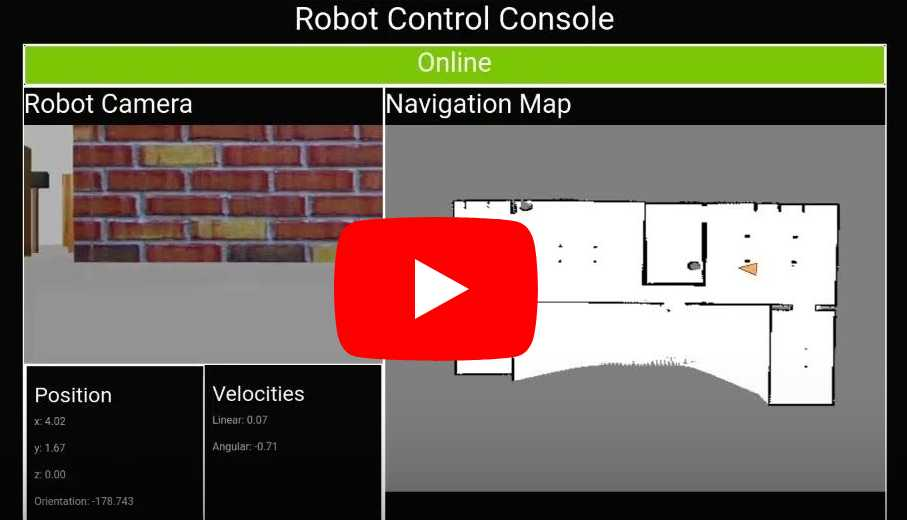

# Robot Control Console | React.js and Bootstrap

## Application Introduction


Welcome to the Robot Control Console, a powerful web application built with React.js and Bootstrap. This console serves as a centralized command hub for controlling robots remotely. The intuitive user interface provides real-time feedback and control over various aspects of the robot's behavior.

### Features

- **Map:** Displays the real-time position of the robot on an interactive map.
- **Video:** Live video feed broadcasted by the robot.
- **Velocity:** Control Angular and Linear velocity for precise robot movement.
- **Joy Stick:** Intuitive control mechanism for robot navigation.
- **Navigation Menu:** Save and navigate to predefined locations with ease.

### Communication with ROSbridge using ROSlib.js

This application communicates seamlessly with the Robot Operating System (ROS) through ROSbridge. ROSbridge facilitates communication between the web application and the robot using websockets. The integration of ROSlib.js allows for efficient and real-time data exchange, enabling precise control and monitoring of the robot's state.

### Libraries Used

- **React.js:** A powerful JavaScript library for building user interfaces, providing a dynamic and responsive experience.
- **Bootstrap:** A front-end framework for developing responsive and mobile-first applications, enhancing the application's visual appeal.
- **ROSlib.js:** A JavaScript library for interacting with ROS, enabling communication between the web application and the robot.
- **ROS2D:** A library for visualizing 2D maps and robot positions within the Robot Operating System (ROS), enhancing the map visualization capabilities.
- **NAV2D:** Further expanding navigation capabilities, NAV2D provides tools for visualizing robot paths and efficiently navigating through environments.

## Getting Started

### Prerequisites

Before getting started, ensure you have Node.js and npm installed on your machine. This project is tested on Node.js version 16.

### Installation

1. Clone the repository:

    ```bash
    git clone https://github.com/ravi-more/reactjs-ros-robot-control-console-web.git
    ```

2. Navigate to the project directory:

    ```bash
    cd reactjs-ros-robot-control-console-web
    ```

3. Install npm packages:

    ```bash
    npm install
    ```

### Start application

```bash
npm start
```

## Application configuration
  
- Adjust settings in src/data/config.js:
  
    ```JavaScript

    const Config = {
        ROSBRIDGE_SERVER_IP: "127.0.0.1",
        ROSBRIDGE_SERVER_PORT: "9090",
        CMD_VEL_TOPIC: "/cmd_vel",
        GOAL_TOPIC: "/move_base_simple/goal",
        VIDEO_STREAM_URL: "http://0.0.0.0:8080/stream?topic=/camera/rgb/image_raw&type=mjpeg&width=300&height=200"
    };

    ```

## Preview

Explore the application with the [Demo Video](https://www.youtube.com/watch?v=hW2OXsxlDro) and get a sneak peek into the Robot Control Console.

[<!-- markdownlint-allow HTML -->](https://www.youtube.com/watch?v=hW2OXsxlDro "ROS Robot Control Console using React JS and Bootstrap")

Feel free to customize the application to suit your needs! If you encounter any issues or have questions, please refer to the documentation or reach out to me.

## Contributing

I welcome contributions from the community! If you'd like to contribute to this project, please follow our [contribution guidelines](CONTRIBUTING.md).

## Acknowledgments

I want to express our gratitude to the open-source community for their valuable contributions and resources that have made this project possible.

## License

This project is licensed under the MIT License. See the [LICENSE](LICENSE) file for details.
